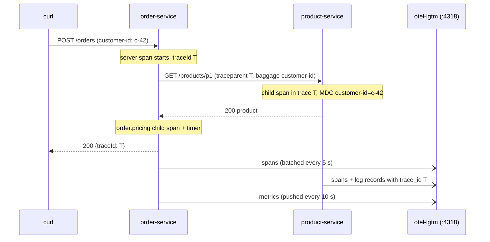
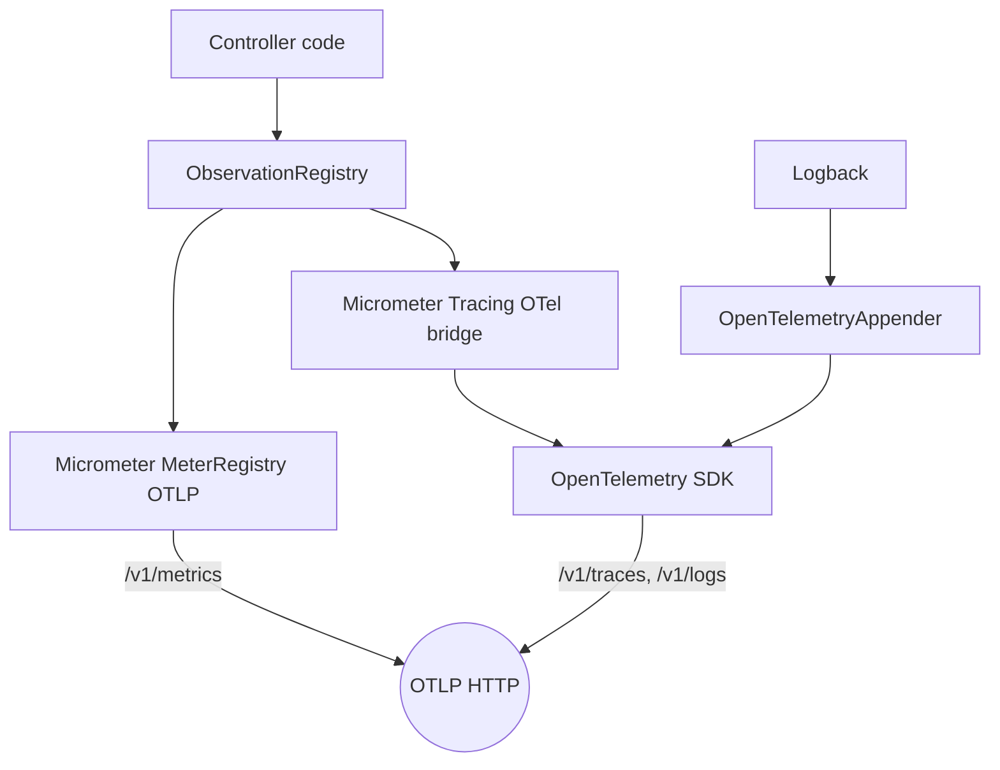
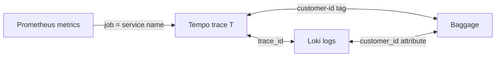

# observe3-otel-lgtm architecture

## One request, three signals

```mermaid
sequenceDiagram
  participant C as curl
  participant O as order-service
  participant P as product-service
  participant L as otel-lgtm (:4318)
  C->>O: POST /orders (customer-id: c-42)
  Note over O: server span starts, traceId T
  O->>P: GET /products/p1 (traceparent T, baggage customer-id)
  Note over P: child span in trace T, MDC customer-id=c-42
  P-->>O: 200 product
  Note over O: order.pricing child span + timer
  O-->>C: 200 {traceId: T}
  O-)L: spans (batched every 5 s)
  P-)L: spans + log records with trace_id T
  O-)L: metrics (pushed every 10 s)
```

## Inside a service

```mermaid
flowchart TB
  code[Controller code] --> obs[ObservationRegistry]
  obs --> mm[Micrometer MeterRegistry OTLP]
  obs --> tr[Micrometer Tracing OTel bridge]
  logback[Logback] --> app[OpenTelemetryAppender]
  tr --> sdk[OpenTelemetry SDK]
  app --> sdk
  mm -->|/v1/metrics| out((OTLP HTTP))
  sdk -->|/v1/traces, /v1/logs| out
```

## Correlation

```mermaid
flowchart LR
  trace[Tempo trace T] <-->|trace_id| logs[Loki logs]
  trace <-->|"customer-id tag"| baggage[Baggage]
  logs <-->|customer_id attribute| baggage
  metrics[Prometheus metrics] -->|job = service.name| trace
```
