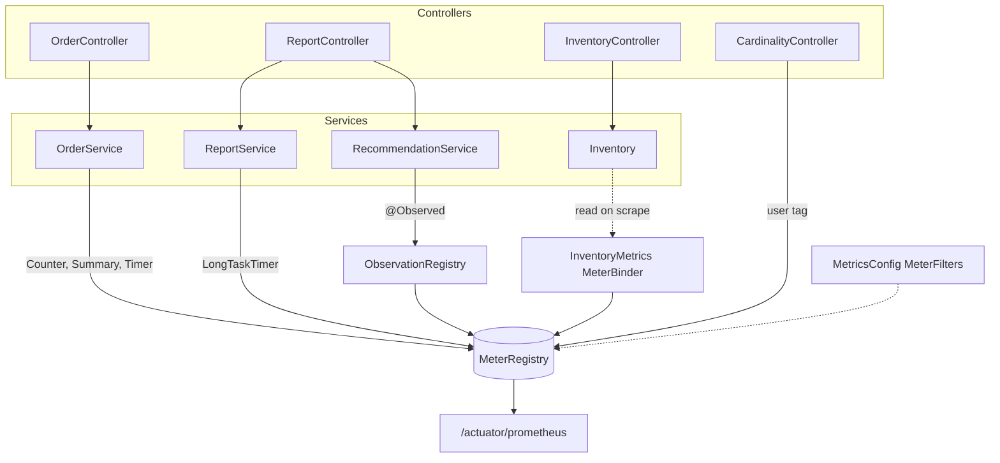
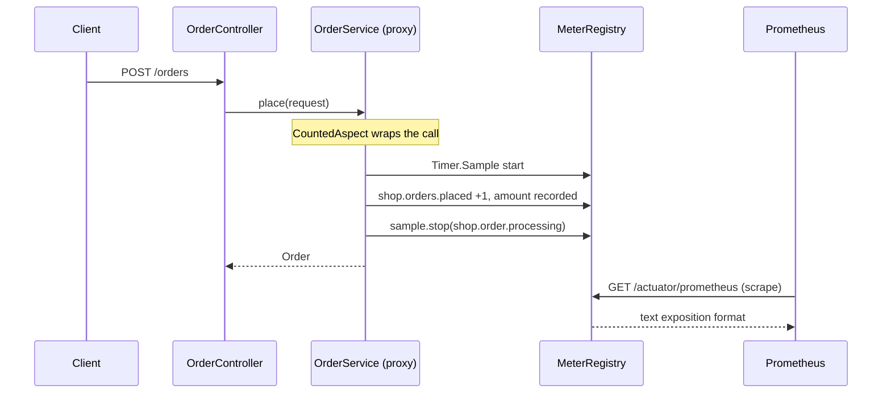

# learn11-actuator architecture

## actuator1-custom-metrics

```mermaid
flowchart TB
  subgraph web[Controllers]
    oc[OrderController]
    ic[InventoryController]
    rc[ReportController]
    cc[CardinalityController]
  end
  subgraph domain[Services]
    os[OrderService]
    inv[Inventory]
    rs[ReportService]
    rec[RecommendationService]
  end
  oc --> os
  ic --> inv
  rc --> rs
  rc --> rec
  os -->|Counter, Summary, Timer| reg[(MeterRegistry)]
  rs -->|LongTaskTimer| reg
  rec -->|"@Observed"| obs[ObservationRegistry] --> reg
  inv -.->|read on scrape| binder[InventoryMetrics MeterBinder] --> reg
  cc -->|user tag| reg
  filters[MetricsConfig MeterFilters] -.-> reg
  reg --> prom["/actuator/prometheus"]
```

How a request becomes a metric:

```mermaid
sequenceDiagram
  participant C as Client
  participant OC as OrderController
  participant OS as OrderService (proxy)
  participant R as MeterRegistry
  participant P as Prometheus
  C->>OC: POST /orders
  OC->>OS: place(request)
  Note over OS: CountedAspect wraps the call
  OS->>R: Timer.Sample start
  OS->>R: shop.orders.placed +1, amount recorded
  OS->>R: sample.stop(shop.order.processing)
  OS-->>OC: Order
  P->>R: GET /actuator/prometheus (scrape)
  R-->>P: text exposition format
```
