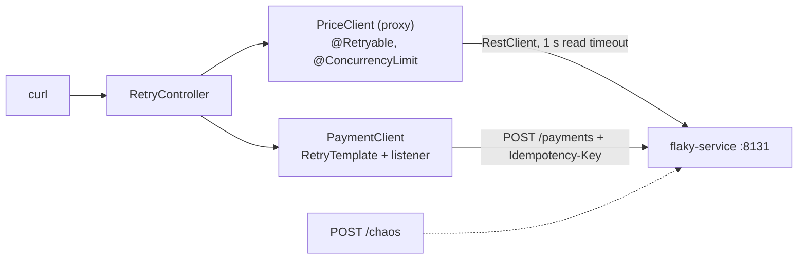
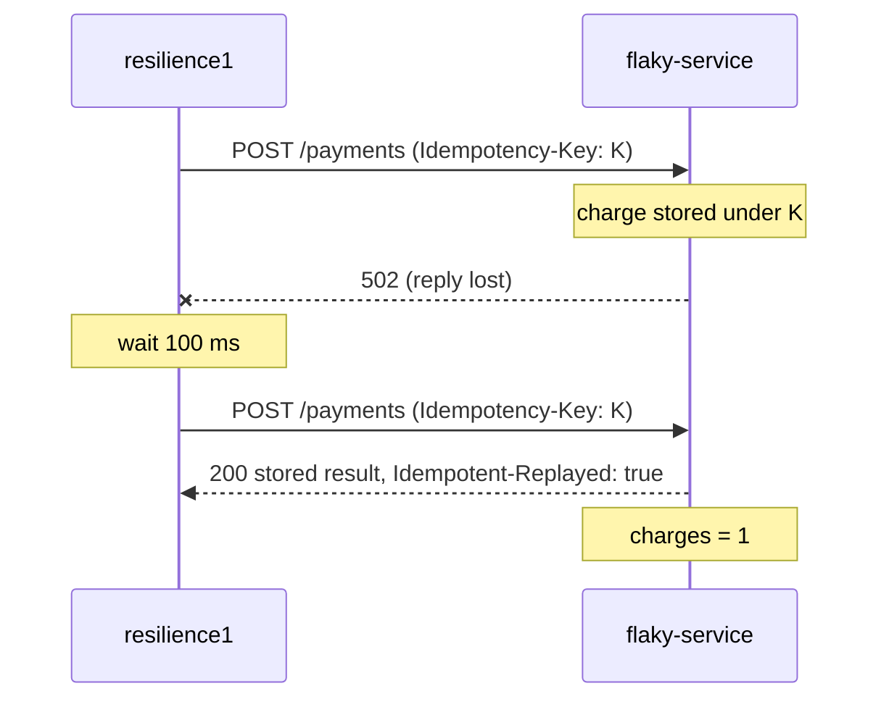
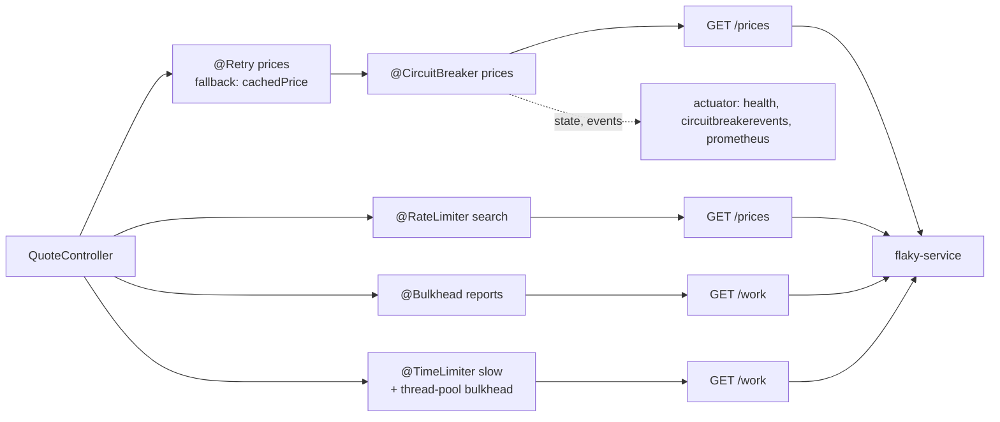

# learn12-resilience architecture

## resilience1-spring-retry

```mermaid
flowchart LR
  c[curl] --> ctl[RetryController]
  ctl --> pc["PriceClient (proxy)<br/>@Retryable, @ConcurrencyLimit"]
  ctl --> pay["PaymentClient<br/>RetryTemplate + listener"]
  pc -->|"RestClient, 1 s read timeout"| fl[flaky-service :8131]
  pay -->|"POST /payments + Idempotency-Key"| fl
  chaos["POST /chaos"] -.-> fl
```

Lost reply, then a safe retry:

```mermaid
sequenceDiagram
  participant A as resilience1
  participant F as flaky-service
  A->>F: POST /payments (Idempotency-Key: K)
  Note over F: charge stored under K
  F--xA: 502 (reply lost)
  Note over A: wait 100 ms
  A->>F: POST /payments (Idempotency-Key: K)
  F-->>A: 200 stored result, Idempotent-Replayed: true
  Note over F: charges = 1
```

## resilience2-resilience4j

```mermaid
flowchart LR
  ctl[QuoteController] --> retry["@Retry prices<br/>fallback: cachedPrice"]
  retry --> cb["@CircuitBreaker prices"]
  cb --> call1[GET /prices]
  ctl --> rl["@RateLimiter search"] --> call2[GET /prices]
  ctl --> bh["@Bulkhead reports"] --> call3[GET /work]
  ctl --> tl["@TimeLimiter slow<br/>+ thread-pool bulkhead"] --> call4[GET /work]
  call1 & call2 & call3 & call4 --> fl[flaky-service]
  cb -.->|state, events| act["actuator: health, circuitbreakerevents, prometheus"]
```
