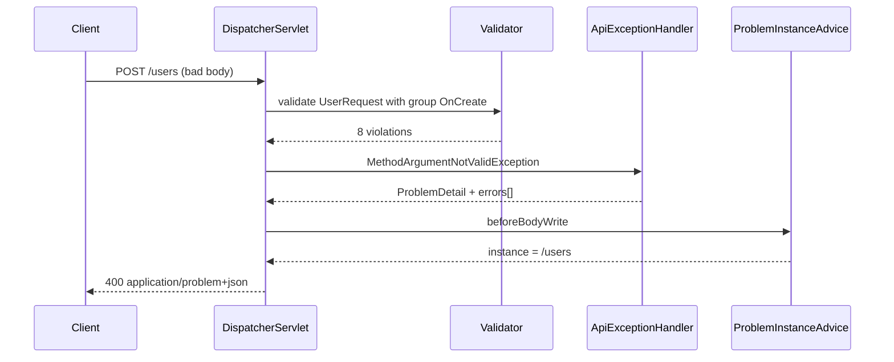
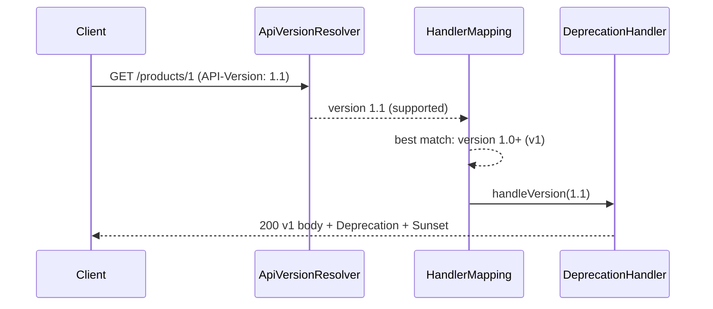
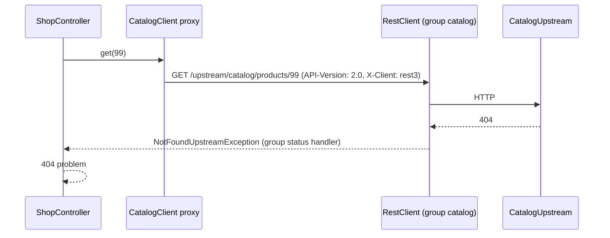

# learn13-rest-api architecture

## rest1-validation-problem-details

```mermaid
sequenceDiagram
  participant C as Client
  participant D as DispatcherServlet
  participant V as Validator
  participant H as ApiExceptionHandler
  participant A as ProblemInstanceAdvice
  C->>D: POST /users (bad body)
  D->>V: validate UserRequest with group OnCreate
  V-->>D: 8 violations
  D->>H: MethodArgumentNotValidException
  H-->>D: ProblemDetail + errors[]
  D->>A: beforeBodyWrite
  A-->>D: instance = /users
  D-->>C: 400 application/problem+json
```

## rest2-api-versioning

```mermaid
sequenceDiagram
  participant C as Client
  participant R as ApiVersionResolver
  participant M as HandlerMapping
  participant D as DeprecationHandler
  C->>R: GET /products/1 (API-Version: 1.1)
  R-->>M: version 1.1 (supported)
  M-->>M: best match: version 1.0+ (v1)
  M->>D: handleVersion(1.1)
  D-->>C: 200 v1 body + Deprecation + Sunset
```

## rest3-http-interface-clients

```mermaid
sequenceDiagram
  participant S as ShopController
  participant P as CatalogClient proxy
  participant RC as RestClient (group catalog)
  participant U as CatalogUpstream
  S->>P: get(99)
  P->>RC: GET /upstream/catalog/products/99 (API-Version: 2.0, X-Client: rest3)
  RC->>U: HTTP
  U-->>RC: 404
  RC-->>S: NotFoundUpstreamException (group status handler)
  S-->>S: 404 problem
```
