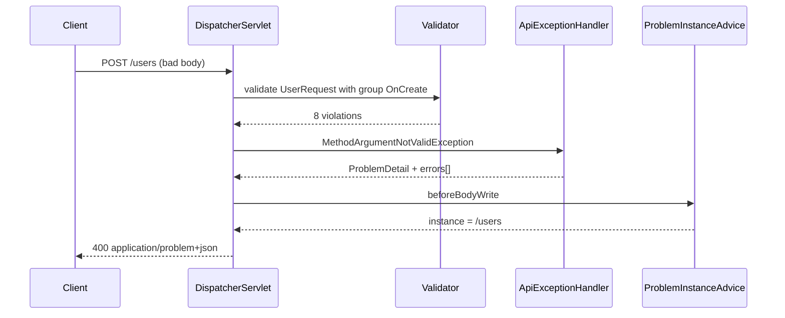

# learn13-rest-api architecture

## rest1-validation-problem-details

```mermaid
sequenceDiagram
  participant C as Client
  participant D as DispatcherServlet
  participant V as Validator
  participant H as ApiExceptionHandler
  participant A as ProblemInstanceAdvice
  C->>D: POST /users (bad body)
  D->>V: validate UserRequest with group OnCreate
  V-->>D: 8 violations
  D->>H: MethodArgumentNotValidException
  H-->>D: ProblemDetail + errors[]
  D->>A: beforeBodyWrite
  A-->>D: instance = /users
  D-->>C: 400 application/problem+json
```
