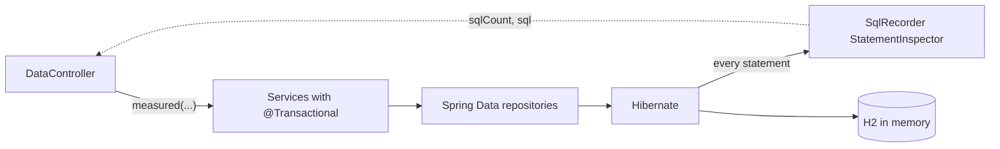
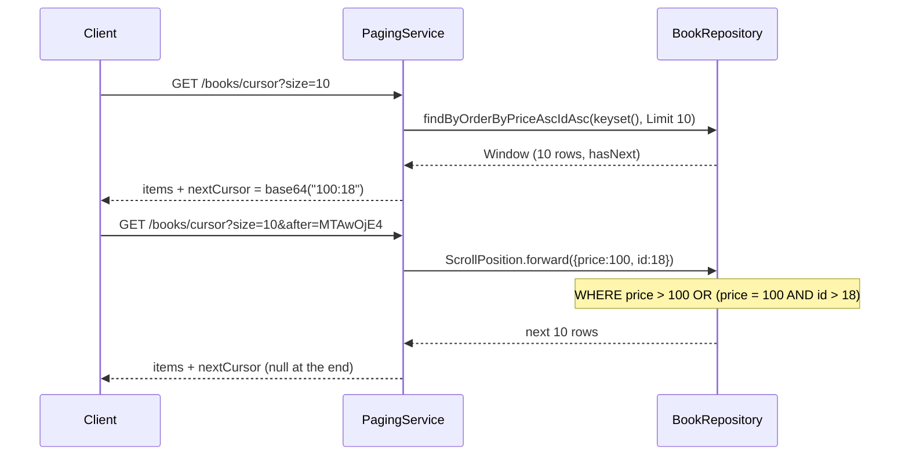
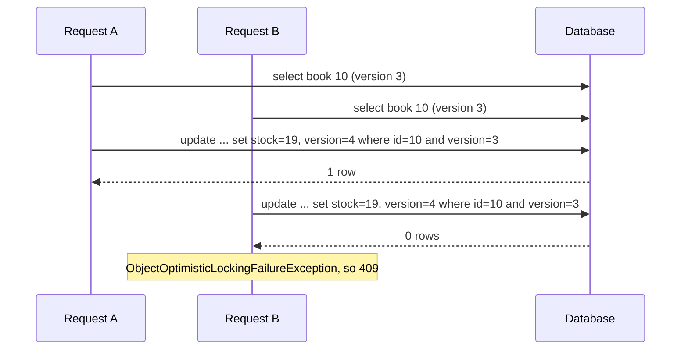

# learn14-data-jpa architecture

```mermaid
flowchart LR
  ctl[DataController] -->|"measured(...)"| svc[Services with @Transactional]
  svc --> repo[Spring Data repositories]
  repo --> hib[Hibernate]
  hib -->|every statement| rec[SqlRecorder StatementInspector]
  hib --> h2[(H2 in memory)]
  rec -.->|sqlCount, sql| ctl
```

Cursor paging:

```mermaid
sequenceDiagram
  participant C as Client
  participant S as PagingService
  participant R as BookRepository
  C->>S: GET /books/cursor?size=10
  S->>R: findByOrderByPriceAscIdAsc(keyset(), Limit 10)
  R-->>S: Window (10 rows, hasNext)
  S-->>C: items + nextCursor = base64("100:18")
  C->>S: GET /books/cursor?size=10&after=MTAwOjE4
  S->>R: ScrollPosition.forward({price:100, id:18})
  Note over R: WHERE price > 100 OR (price = 100 AND id > 18)
  R-->>S: next 10 rows
  S-->>C: items + nextCursor (null at the end)
```

Optimistic locking conflict:

```mermaid
sequenceDiagram
  participant A as Request A
  participant B as Request B
  participant DB as Database
  A->>DB: select book 10 (version 3)
  B->>DB: select book 10 (version 3)
  A->>DB: update ... set stock=19, version=4 where id=10 and version=3
  DB-->>A: 1 row
  B->>DB: update ... set stock=19, version=4 where id=10 and version=3
  DB-->>B: 0 rows
  Note over B: ObjectOptimisticLockingFailureException, so 409
```
