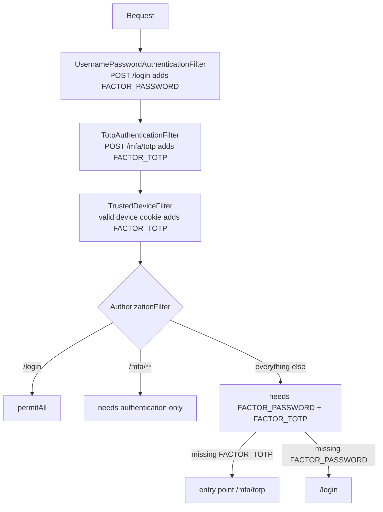
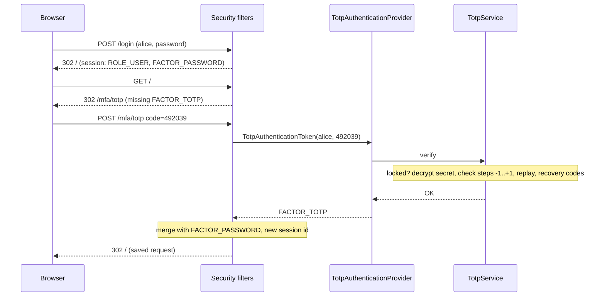
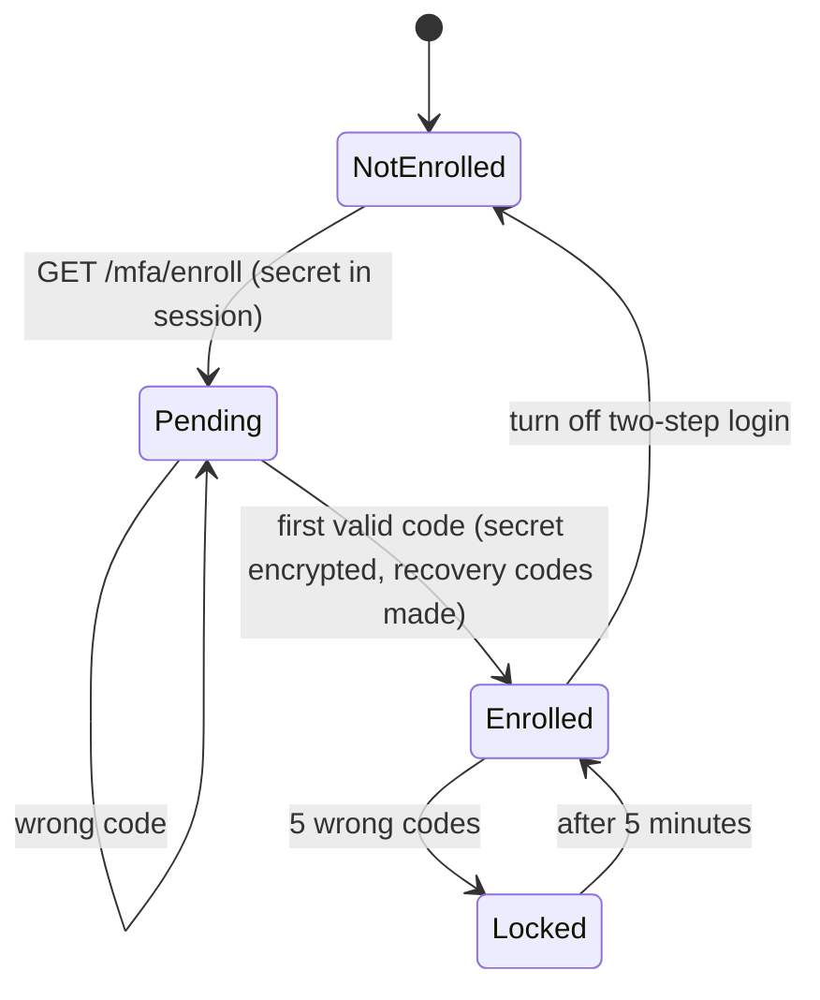
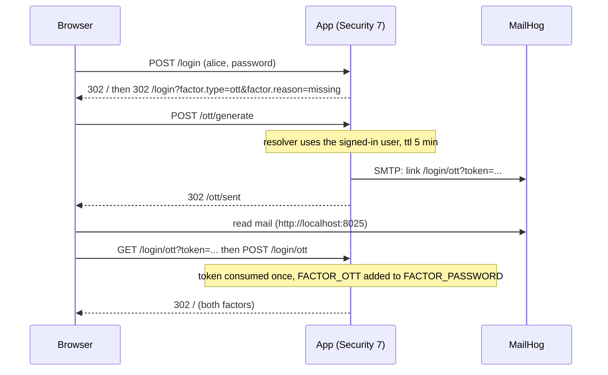

# MFA architecture

## mfa1-totp filter chain

```mermaid
flowchart TB
  req[Request] --> upf["UsernamePasswordAuthenticationFilter<br/>POST /login adds FACTOR_PASSWORD"]
  upf --> tf["TotpAuthenticationFilter<br/>POST /mfa/totp adds FACTOR_TOTP"]
  tf --> tdf["TrustedDeviceFilter<br/>valid device cookie adds FACTOR_TOTP"]
  tdf --> az{"AuthorizationFilter"}
  az -->|"/login"| ok[permitAll]
  az -->|"/mfa/**"| pw[needs authentication only]
  az -->|"everything else"| both["needs FACTOR_PASSWORD + FACTOR_TOTP"]
  both -->|missing FACTOR_TOTP| ep["entry point /mfa/totp"]
  both -->|missing FACTOR_PASSWORD| login["/login"]
```

## Login with TOTP

```mermaid
sequenceDiagram
  participant B as Browser
  participant S as Security filters
  participant P as TotpAuthenticationProvider
  participant T as TotpService
  B->>S: POST /login (alice, password)
  S-->>B: 302 / (session: ROLE_USER, FACTOR_PASSWORD)
  B->>S: GET /
  S-->>B: 302 /mfa/totp (missing FACTOR_TOTP)
  B->>S: POST /mfa/totp code=492039
  S->>P: TotpAuthenticationToken(alice, 492039)
  P->>T: verify
  Note over T: locked? decrypt secret, check steps -1..+1, replay, recovery codes
  T-->>P: OK
  P-->>S: FACTOR_TOTP
  Note over S: merge with FACTOR_PASSWORD, new session id
  S-->>B: 302 / (saved request)
```

## Enrollment states

```mermaid
stateDiagram-v2
  [*] --> NotEnrolled
  NotEnrolled --> Pending: GET /mfa/enroll (secret in session)
  Pending --> Pending: wrong code
  Pending --> Enrolled: first valid code (secret encrypted, recovery codes made)
  Enrolled --> Locked: 5 wrong codes
  Locked --> Enrolled: after 5 minutes
  Enrolled --> NotEnrolled: turn off two-step login
```

## mfa2-email-ott

```mermaid
sequenceDiagram
  participant B as Browser
  participant A as App (Security 7)
  participant M as MailHog
  B->>A: POST /login (alice, password)
  A-->>B: 302 / then 302 /login?factor.type=ott&factor.reason=missing
  B->>A: POST /ott/generate
  Note over A: resolver uses the signed-in user, ttl 5 min
  A->>M: SMTP: link /login/ott?token=...
  A-->>B: 302 /ott/sent
  B->>M: read mail (http://localhost:8025)
  B->>A: GET /login/ott?token=... then POST /login/ott
  Note over A: token consumed once, FACTOR_OTT added to FACTOR_PASSWORD
  A-->>B: 302 / (both factors)
```
